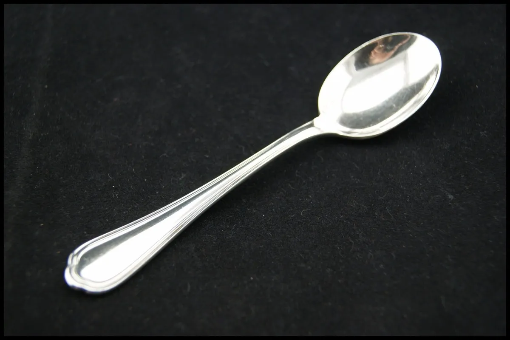

# Image Segmentation Project: Otsu's Method

## Overview

This project implements image segmentation using Otsu's thresholding method. It converts a color image to grayscale, calculates an optimal threshold, and segments the image based on this threshold.

## Requirements

- Python 3.x
- OpenCV (`cv2`)
- NumPy

Install the required packages with: pip install opencv-python numpy

## Usage

1. Place the input image file (`c_image.webp`) in the project directory.
2. Run the script `image_segmentation.py`.
3. Output image generated:
   - `c_segmented_image.jpg`: Segmented image based on Otsu's method.

## Results

Performance metrics:
- **Mean Intensity of Segmented Regions**

### Sample Images

- **Original Image**
  

- **Segmented Image**
  

## Conclusion

This project illustrates the application of Otsu's method for image segmentation, highlighting the conversion to grayscale and thresholding techniques to effectively separate foreground from background.

